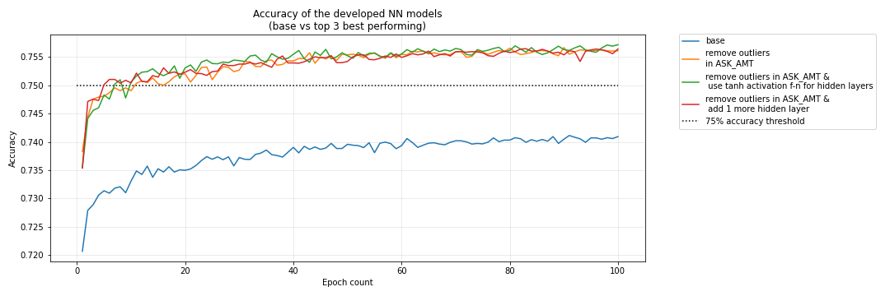

# Deep Learning: Charity Funding Predictor

## Background

The non-profit foundation Alphabet Soup wants to create an algorithm to predict whether or not applicants for funding will be successful. Using the features in the provided dataset a binary classifier is created, through the application of Neural Networks, that is capable of predicting whether applicants will be successful if funded by Alphabet Soup. 

Input data is provided within a CSV file, which contains more than 34,000 organizations that have received funding from Alphabet Soup over the years. Within this dataset are a number of columns that capture metadata about each organization, such as the following:

* **EIN** and **NAME**—Identification columns

* **APPLICATION_TYPE**—Alphabet Soup application type

* **AFFILIATION**—Affiliated sector of industry

* **CLASSIFICATION**—Government organization classification

* **USE_CASE**—Use case for funding

* **ORGANIZATION**—Organization type

* **STATUS**—Active status

* **INCOME_AMT**—Income classification

* **SPECIAL_CONSIDERATIONS**—Special consideration for application

* **ASK_AMT**—Funding amount requested

* **IS_SUCCESSFUL**—Was the money used effectively

  

## Workflow

### Data Preprocessing

Used Scikit-Learn’s `StandardScaler()` to preprocess the dataset in order to compile, train, and evaluate the neural network model.

Using the information we have provided in the starter code, follow the instructions to complete the preprocessing steps.

* Pushed the input csv to gitHub and red raw file [charity_data.csv](Resources/charity_data.csv) using Pandas native function into a Pandas DataFrame:
* Identified target (IS_SUCCESSFUL) and feature (the remaining ones) columns

  * Droped the `EIN` and `NAME` columns.
  * Determined the number of unique values for each column.
    
      * For those columns that have more than 10 unique values, determine the number of data points for each unique value.
         
        Use the number of data points for each unique value to pick a cutoff point to bin "rare" categorical variables together in a new value, `Other`
        

* Used `pd.get_dummies()` to encode categorical variables

### Compilation, Training, and Evaluation of the Model

First step was the design of a neural network (deep learning model), to create a binary classification model that can predict if an Alphabet Soup–funded organization will be successful based on the features in the dataset. 

The starting base model had 2 hidden layer, size of the 1st layer was 80 neurons and 2nd one - 30. a RELU function was used as an activation function for the hidden layers and SIGMOID function was used for the final output layer. Model was trained for 100 epochs. 

Then the model was compiled, trained, and evaluated based on model's loss and accuracy. The accuracy achived was just over 72% and therefore was insufficient.

Model was saved and exported HDF5 file, and name it `AlphabetSoupCharity.h5`.

### Model Optimization

Optimization was performed in order to achieve a target predictive accuracy higher than 75%. 

Best accuracy improvement was achived by:

* removing outliers:

* Adding more hidden layers (3 vs 2)

* Using different activation functions for the hidden layers. (TANH vs RELU)

  

  Below is the summary table outlining the models' key metrics through all the evaluated modifications

  

### Summary

Based on the results of the initially constructed model and subsequent optimization attempts removing outliers from the funcding amount column (ASK_AMOUNT) had the most drastic impact on models accuracy with an increase of 2% . Addition of an extra hidden layer on top of removal of the outliers didnt have any significant impact. Change of the activation function from RELU to TANH also did not change the overall accuracy, but looking at the chart of accuracy score evolution vs epochs one can observe slight uptake in green trend towards the end of the run, so one can speculate that with greater number of epochs  algorithm performance might still have room for improvement.
